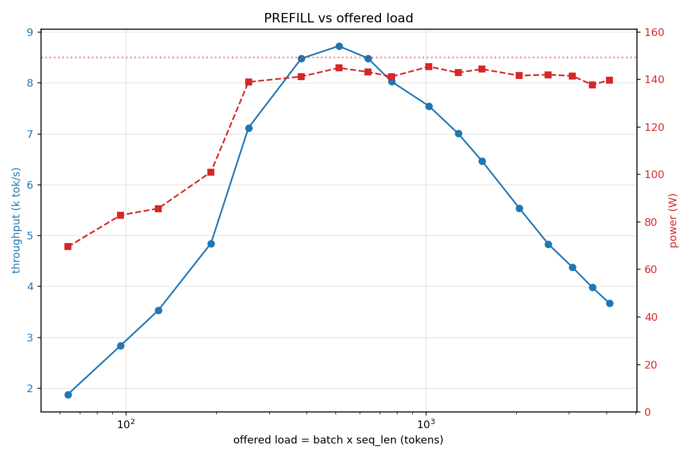
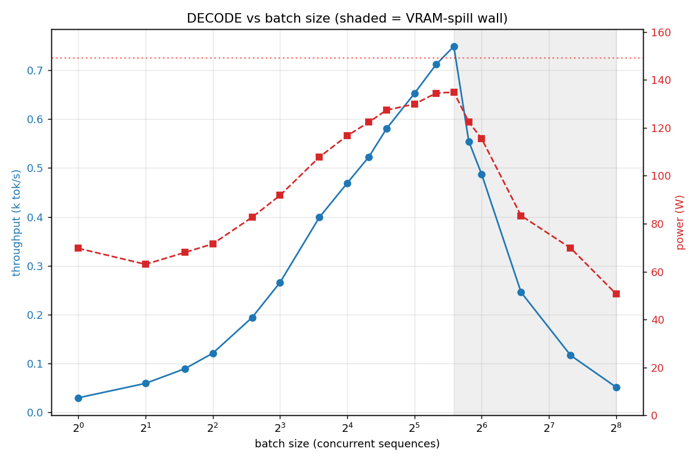
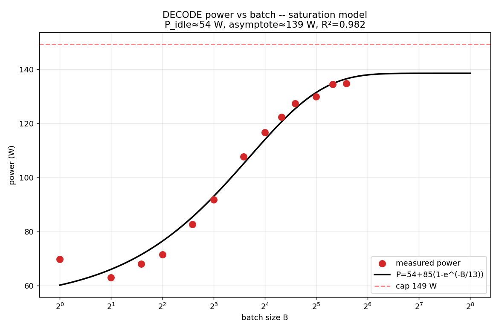
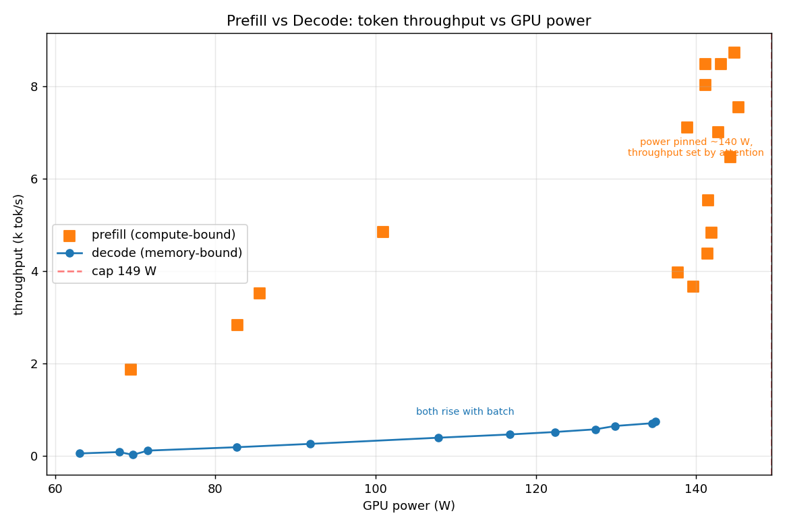

# LLM Inference Power Characterisation — Prefill vs Decode

Real measurements on real hardware of **token throughput vs GPU power** for the
two phases of LLM inference, plus an **analytic model** validated against the
data. Everything is reproducible from a single config file.

- **What is measured** — for a *given* model + parameter config, the
  throughput↔power relationship in **prefill** (prompt ingestion, compute-bound)
  and **decode** (token generation, memory-bandwidth-bound), swept separately.
- **The model** — roofline + DVFS derivations in
  [ANALYTIC_MODEL.md](ANALYTIC_MODEL.md), fitted to the data with R² and MAPE.
- **The plan** — the step-by-step requirements in [WORKPLAN.md](WORKPLAN.md).

## Setup (measured, not assumed)

| | |
|---|---|
| Model | `Qwen/Qwen2.5-1.5B-Instruct` — 1.544 B params, 28 layers, d=1536, GQA 12q:2kv×128, fp16, SDPA |
| GPU | NVIDIA GeForce RTX 5060, 8 GB, **149 W** cap (Blackwell sm_120) |
| Measured peak | **38.1 TFLOP/s** fp16, **372 GB/s** bandwidth → roofline ridge **102 FLOP/byte** |
| Host | Windows 11, driver 591.86 / CUDA 13.1, PyTorch 2.11+cu128, transformers 5.x |
| Telemetry | NVML (`pynvml`) sampled at 50 Hz, averaged over the exact timed window |

## How to run

```bash
pip install -r requirements.txt
python code/model_info.py            # Step 0: model+GPU constants, roofline
python code/measure.py --phase both  # Steps 1-2: prefill + decode sweeps -> CSVs
python code/analyze.py --step all    # Steps 1-4: all figures + model fits
```

## Results

### Step 0 — the chip


Decode (arithmetic intensity ≈ batch) lives left of the ridge → **memory-bound**;
prefill (intensity ≈ seq_len) lives far right → **compute-bound**.

### Step 1 — Prefill: compute-bound, power pinned at the cap


| load (1×S) | tok/s | power W | util | tok/J |
|---|---|---|---|---|
| 1×64   | 1 877 |  69 | 35 % | 27.0 |
| 1×256  | 7 115 | 139 | 72 % | 51.2 |
| **1×512**  | **8 722** | 145 | 89 % | **60.3** |
| 1×1024 | 7 542 | 145 | 84 % | 51.9 |
| 1×2048 | 5 535 | 142 | 88 % | 39.1 |
| 1×4096 | 3 665 | 140 | 98 % | 26.2 |

Throughput is an **inverted-U**: it rises as the sequence fills the 30 SMs
(occupancy-limited, power climbs 69→145 W), peaks at S≈512, then falls as
attention's O(S²) cost grows — all while **power stays pinned at ~140 W**. The
throughput↔power locus is therefore nearly **vertical**: power is fixed by the
clock ceiling, throughput is set by the workload.

### Step 2 — Decode: memory-bandwidth-bound, power & throughput rise with batch


| batch | tok/s | power W | util | tok/J |
|---|---|---|---|---|
| 1   |  29 |  70 | 44 % | 0.4 |
| 8   | 266 |  92 | 65 % | 2.9 |
| 16  | 469 | 117 | 86 % | 4.0 |
| 32  | 653 | 130 | 91 % | 5.0 |
| **48**  | **749** | 135 | 94 % | **5.6** |

Each decode step re-reads all 3.09 GB of weights to emit only `batch` tokens —
the textbook memory bottleneck. Throughput and power both **rise with batch**
toward the ceiling (a rising diagonal locus). Beyond b≈48 the KV cache exhausts
the 8 GB VRAM (shared ~1.7 GB with the desktop) and WDDM spills to host memory,
collapsing throughput — a hard memory wall, documented and excluded.

### Steps 3–4 — analytic model & synthesis
| | |
|---|---|
|  |  |
|  |  |

| model | form | fit | key result |
|---|---|---|---|
| prefill | `tput = 1/(a+b·S)` | **R²=0.996**, MAPE 1.2 % | MFU 78 %; attention doubles cost at S≈1948 |
| decode | `t_step = t_fixed + β·B` | **R²=0.981**, MAPE 9.2 % | t_fixed 28 ms (~20 ms launch overhead), asymptote 1.5 k tok/s |
| power | `P = P_idle + A(1−e^{−B/B₀})` | **R²=0.982** | P_idle 54 W → asymptote 139 W |

**Energy:** prefill is **26–60 tok/J** vs decode **0.4–5.6 tok/J** — ~11× more
efficient per token at best (see `figures/step4_efficiency_comparison.png`).

Full derivations and the measured-vs-theory discussion: [ANALYTIC_MODEL.md](ANALYTIC_MODEL.md).

## Caveats / next experiment

GPU clock-lock and power-limit control need admin on this Windows host (denied),
so the **DVFS "≈cubic" power law** `P ∝ tput^γ` could not be measured directly —
it is derived analytically (ANALYTIC_MODEL §5). At the fixed clock ceiling the
two phases instead trace the vertical (prefill) and diagonal (decode) loci above.
Measuring the cubic law directly is the natural follow-up on a clock-controllable
host. Also, no flash/mem-efficient SDPA kernel exists for this sm_120 build, so
prefill attention is O(S²) in memory and hits the 8 GB wall at S≈5 k.

## Files
```
code/config.py        all experiment parameters (model, sweeps, timing)
code/model_info.py    Step 0: arch extraction + peak-FLOP/BW microbench + roofline
code/measure.py       Steps 1-2: prefill & decode sweeps -> results/*.csv
code/analyze.py       Steps 1-4: fits + every figure
code/power_sampler.py 50 Hz NVML sampler with windowed aggregation
results/              *.csv, model_info.json, fit_summary.json
figures/              step0..step4 PNGs
```
