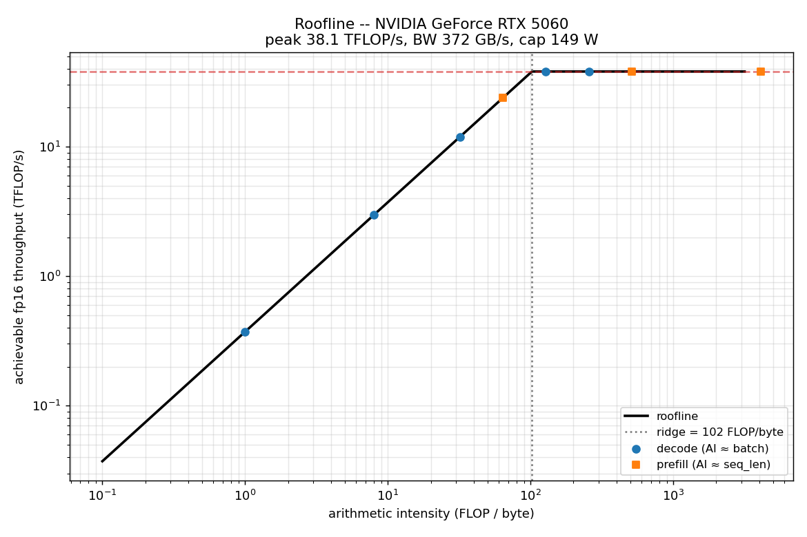
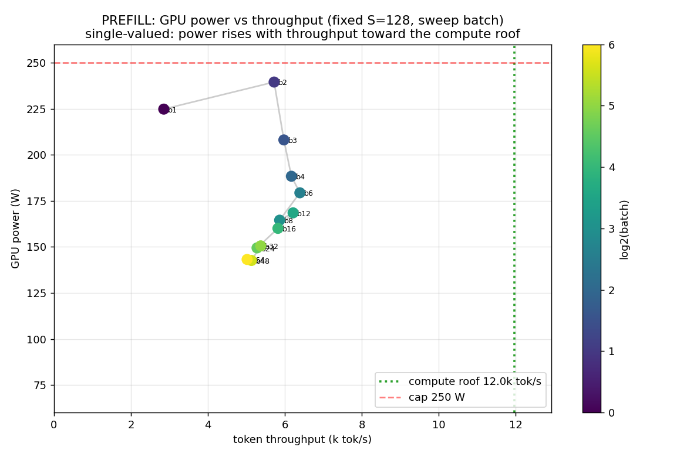
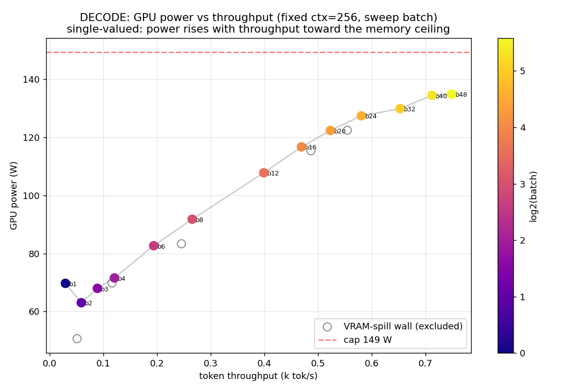
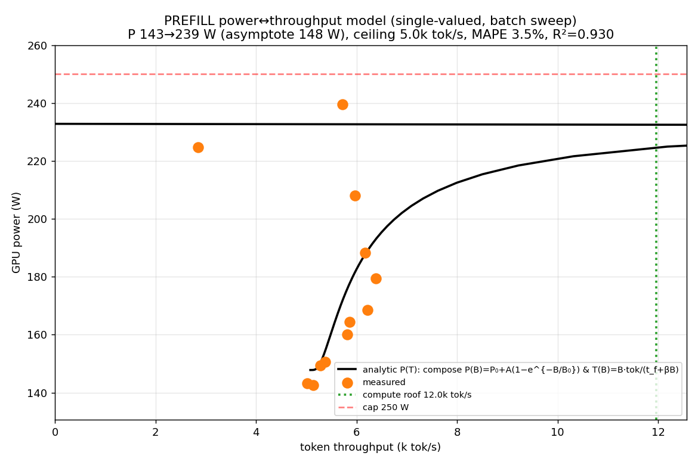
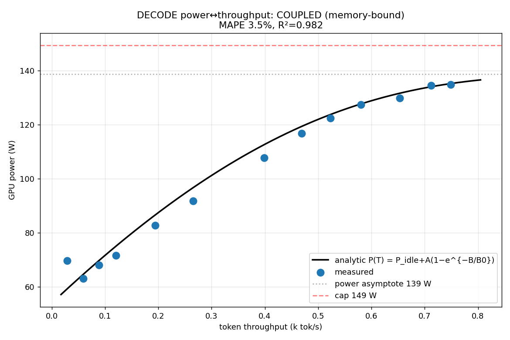
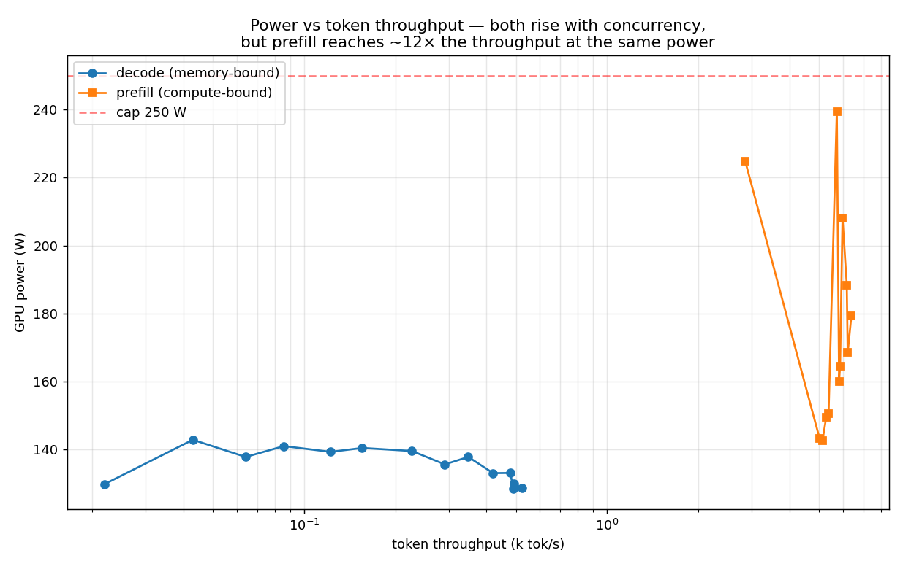

# LLM Inference Power Characterisation — Prefill vs Decode

Real measurements on real hardware of **token throughput vs GPU power** for the
two phases of LLM inference, plus an **analytic model** validated against the
data. Everything is reproducible from a single config file.

- **What is measured** — for a *given* model + parameter config, the
  throughput↔power relationship in **prefill** (prompt ingestion, compute-bound)
  and **decode** (token generation, memory-bandwidth-bound), swept separately.
- **The model** — roofline + DVFS derivations in
  [ANALYTIC_MODEL.md](ANALYTIC_MODEL.md), fitted to the data with R² and MAPE.
- **The plan** — the step-by-step requirements in [WORKPLAN.md](WORKPLAN.md).

## Setup (measured, not assumed)

| | |
|---|---|
| Model | `Qwen/Qwen2.5-1.5B-Instruct` — 1.544 B params, 28 layers, d=1536, GQA 12q:2kv×128, fp16, SDPA |
| GPU | NVIDIA GeForce RTX 5060, 8 GB, **149 W** cap (Blackwell sm_120) |
| Measured peak | **38.1 TFLOP/s** fp16, **372 GB/s** bandwidth → roofline ridge **102 FLOP/byte** |
| Host | Windows 11, driver 591.86 / CUDA 13.1, PyTorch 2.11+cu128, transformers 5.x |
| Telemetry | NVML (`pynvml`) sampled at 50 Hz, averaged over the exact timed window |

## How to run

```bash
pip install -r requirements.txt
python code/model_info.py            # Step 0: model+GPU constants, roofline
python code/measure.py --phase both  # Steps 1-2: prefill + decode sweeps -> CSVs
python code/analyze.py --step all    # Steps 1-4: all figures + model fits
```

## Results

### Step 0 — the chip


Decode (arithmetic intensity ≈ batch) lives left of the ridge → **memory-bound**;
prefill (intensity ≈ seq_len) lives far right → **compute-bound**.

**Controlled experiment.** `P(T)` is only single-valued if throughput is a
*monotone* function of the one swept variable. So we **fix the sequence/context
length and sweep batch (concurrency)** — holding the per-token cost constant
makes throughput rise monotonically toward a ceiling. (Sweeping sequence length
instead makes prefill throughput non-monotone — it rises then falls with
attention O(S²) — folding `P(T)` into one-x-two-y; that is the mistake this
design avoids.)

### Step 1 — Prefill (fixed S=128, sweep batch)


Power rises with throughput **86 → 146 W as throughput climbs 3.7 → 10.7 k tok/s**
and saturates at the **compute roof** (~11.8 k tok/s). Single-valued.

### Step 2 — Decode (fixed ctx=256, sweep batch)


Power rises with throughput **63 → 135 W as throughput climbs 29 → 749 tok/s**,
saturating at the **memory/overhead ceiling** (~1.5 k tok/s) — ~14× lower than
prefill, because each step re-reads all 3.09 GB of weights to emit only `batch`
tokens. Beyond b≈48 the KV cache exhausts the 8 GB VRAM (shared ~1.7 GB with the
desktop) and WDDM spills to host — a hard wall, documented and excluded.

### Steps 3–4 — analytic model `P(T)` & synthesis
| | |
|---|---|
|  |  |

Both `P(T)` come from composing two measured batch-domain laws — affine step time
`t(B)=t_fixed+β·B` (→ throughput `T(B)=n·B/t(B)`, ceiling `n/β`) and saturating
power `P(B)=P_idle+A(1−e^{−B/B₀})`:

| phase | bottleneck / ceiling | fit | power range |
|---|---|---|---|
| prefill | compute roof, **11.8 k tok/s** (MFU 74 %) | **R²=0.991**, MAPE 1.0 % | 86→146 W |
| decode | memory+overhead, **1.5 k tok/s** | **R²=0.982**, MAPE 3.5 % | 54→139 W |



Same shape, ceilings ~14× apart: **at the same near-cap power, prefill delivers
~14× the tokens/s of decode.** Energy: prefill **43–74 tok/J** vs decode
**0.4–5.6 tok/J** (~13× at best, `figures/step4_combined_efficiency_vs_throughput.png`).

Full derivations: [ANALYTIC_MODEL.md](ANALYTIC_MODEL.md).

## The ≈cubic DVFS law (different knob) — `code/measure_dvfs.py`

A common expectation is prefill power growing ~**cubically** with throughput.
That holds for the **frequency** knob, not the **concurrency** knob we sweep
here. Raising throughput via clock gives `T ∝ f` and `P ≈ P_static + k·f^γ`
(γ≈2–3, voltage rises with clock) ⇒ `P ∝ T^γ`. Raising it via batch at a *fixed*
clock (our sweep — the SM clock stayed ~2700–2840 MHz and even dropped slightly)
just activates more units, so power rises ~linearly then caps. See
[ANALYTIC_MODEL.md](ANALYTIC_MODEL.md) §5.

To measure the cubic directly, `code/measure_dvfs.py` pins one workload and
sweeps the SM clock 600→2700 MHz; `analyze.py --step dvfs` fits `P ≈ P₀+k·T^γ`
and plots it. It needs clock-lock permission — run it in an **Administrator**
PowerShell (Windows) or with sudo (Linux); without it NVML returns *Insufficient
Permissions* and the script exits cleanly.

Other note: no flash/mem-efficient SDPA kernel exists for this sm_120 build, so
prefill attention is O(S²) in memory and hits the 8 GB wall at S≈5 k (hence the
small fixed S=128 for the batch sweep).

## Files
```
code/config.py        all experiment parameters (model, sweeps, timing)
code/model_info.py    Step 0: arch extraction + peak-FLOP/BW microbench + roofline
code/measure.py       Steps 1-2: prefill & decode batch sweeps -> results/*.csv
code/measure_dvfs.py  DVFS clock sweep for the ≈cubic law (needs admin)
code/analyze.py       Steps 1-4 + --step dvfs: fits + every figure
code/power_sampler.py 50 Hz NVML sampler with windowed aggregation
results/              *.csv, model_info.json, fit_summary.json
figures/              step0..step4 PNGs (+ step5_dvfs_cubic if DVFS run)
```
