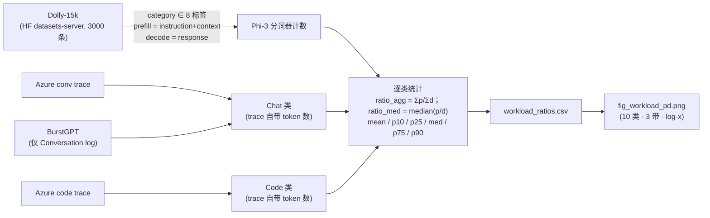

# LLM 推理负载分类：原理、流程与引用（论文方法学底稿）

> 本文是 `workload_analysis/` 中 **workload 分类**的完整方法学文档，面向论文写作：
> 分类的**原理**（为什么分、按什么分）、**流程**（数据从哪来、怎么算、怎么落到实测）、
> **引用**（文献依据与建议引用格式）。结果图：[fig_workload_pd.png](fig_workload_pd.png)；
> 数字全部可由 [analyze.py](analyze.py) / [plot.py](plot.py) 复现，并已逐条对照代码与数据核验。
> 上层机架规划见 [PLANNING.zh.md](PLANNING.zh.md)，引用总览见 [REFERENCES.zh.md](REFERENCES.zh.md)。

---

## 1. 问题定义与动机

### 1.1 为什么功率规划需要 workload 分类

LLM 推理由两个资源特征完全不同的阶段组成：

- **prefill**（处理输入提示）：算力受限（compute-bound），吞吐随功率近似线性提升；
- **decode**（逐 token 生成输出）：带宽/访存受限（memory-bound），吞吐在较低功率处即饱和，
  且饱和平台随**上下文长度 C** 急剧下降（`T_max ∝ 1/C`，见总纲
  [../MODEL_AND_RESULTS.zh.md](../MODEL_AND_RESULTS.zh.md)）。

因此一个机架该给 prefill / decode 各配几张卡、每张卡功率 cap 设多少瓦，取决于流量的三个属性：

1. **请求形状 P:D**——输入 token 与输出 token 的比例，决定两相的算力需求配比；
2. **上下文量级 C**——决定 decode 的吞吐天花板（同一张 V100，256 上下文的 chat 平台
   825 tok/s，32k 摘要只剩 6.4 tok/s，差两个数量级）；
3. **延迟 SLO**——交互类压 cap 直接抬 TTFT / 逐字延迟，批处理类可压到能效甜点。

早期做法把全部流量压成一个合成的 prefill:decode 比例。这在数学上干净，但等于假设"全世界的
请求都长一个样"：真实流量画在 `(L_p, L_d)` 平面上是散落的几团点云，而单一比例只承认一条过
原点的射线。**分类是消除这种异质性的第一步**：在 router 假设下（每个机架只服务一类应用），
每个机架内部同质、可独立规划，规划问题分解为"机架内配方"与"机架间配额"两层。

### 1.2 分类要回答的两个问题

1. **类别从哪来？**——不能自拟。需要一个来自真实生产流量、文献公认的使用类型分类法（§2）。
2. **每类的 P:D 是多少？**——不能拍脑袋。需要用真实数据（人工指令集 + 生产 trace）逐类
   实测（§3–§4）。

---

## 2. 分类法：InstructGPT 使用类型分类（taxonomy）

### 2.1 选择的分类法

采用 **InstructGPT**（Ouyang et al., 2022 [1]）**Table 1** 中从真实 OpenAI API 提示流量
归纳的使用类型分类，共 **10 类**（括号内为该文报告的 API 提示占比，合计 99.9% 系四舍五入）：

> Generation 生成（45.6%）· Open QA 开放问答（12.4%）· Brainstorming 头脑风暴（11.2%）·
> Chat 对话（8.4%）· Rewrite 改写（6.6%）· Summarization 摘要（4.2%）·
> Classification 分类（3.5%）· Other 杂项（3.5%）· Closed QA 闭卷问答（2.6%）·
> Extract 抽取（1.9%）

选择理由：

1. **来自真实生产使用统计**——该分类由标注者对提交到 OpenAI API 的真实提示打标归纳而来
   （原文 Table 1 标题："Distribution of use case categories from our API prompt dataset"），
   不是研究者凭空划分的任务清单；
2. **粒度合理**——10 类足以区分"给定上下文加工"与"自由生成"两大端，又不至于碎到无法配数据；
3. **与功率规划的区分维度天然对齐**——每类的 input/output（= prefill/decode）长度特征
   系统性不同，正是机架配方需要的输入。

### 2.2 覆盖情况（如实说明）

InstructGPT 的 10 类中，本工作 **8 类有数据**；未覆盖与增补如下：

| 处置 | 类别 | 原因 |
|---|---|---|
| 未单列 | Rewrite（改写） | 无干净公开数据集；**假设**其 input≈output（P:D≈1:1，无数据支撑），由平衡带覆盖 |
| 不计 | Other（杂项） | 定义即为杂项残差类，无形状语义 |
| 增补 † | General QA（常识问答） | Dolly-15k 增设的自由问答类（非 InstructGPT 原类，见 §3.1） |
| 增补 ‡ | Code（代码补全） | InstructGPT 分类（2022）早于代码助手爆发；代码补全是当下最重要的 prefill-重生产负载之一，用生产 trace 补上 |

最终共 **10 个使用类型**进入统计（InstructGPT 8 类 + General QA † + Code ‡）。

---

## 3. 数据来源（operationalization 的原料）

| 数据源 | 覆盖类别 | 性质 | 规模（本统计） | token 计数方式 |
|---|---|---|---|---|
| **Dolly-15k** [2]（`databricks-dolly-15k`） | 7 个 InstructGPT 类 + General QA | 人工撰写的真实指令数据集（非模型合成），自带人工 `category` 标签 | 抽样 3,000 条（8 类合计） | 本地 Phi-3 分词器计数 |
| **Azure LLM Inference Trace (conv)** [3] | Chat | 生产对话 trace（线上实测 token 数，2023-11） | 19,366 条 | trace 自带 `ContextTokens` / `GeneratedTokens` |
| **BurstGPT** [4]（Conversation log 部分） | Chat | 生产对话 trace（ChatGPT 服务日志） | 6,221 条（与 Azure conv 合并统计，合计 25,587） | trace 自带 `Request tokens` / `Response tokens` |
| **Azure LLM Inference Trace (code)** [3] | Code ‡ | 生产代码补全 trace | 8,819 条 | trace 自带 token 计数 |

数据源选择的关键依据：

- **Dolly-15k 的标签血统**：其官方数据卡片写明，标注者被要求在 8 个指令类别下撰写样本，
  **其中 7 个类别取自 InstructGPT 论文**，第 8 个是 Databricks 增设的开放自由问答类
  （即 `general_qa` 标签）。因此从 Dolly 标签到 InstructGPT 类别只是**近乎恒等的重命名映射**
  （`analyze.py` 中的 `DOLLY_MAP`），无需自建分类判据；唯一非平凡的一条是
  `creative_writing → Generation`——Dolly 的创意写作子集在此代表 InstructGPT 更宽泛的
  Generation 类（子集代表整体，见 §7）。落地口径：`prefill = instruction (+context)`，
  `decode = response`。
- **Chat 必须用生产 trace**：Dolly 是单轮指令、没有 Chat 类；Azure conv + BurstGPT 提供
  真实多轮对话的线上实测 token 数。两个独立生产源各自的聚合 P:D 分别为 **5.47:1**（Azure conv，
  n=19,366）与 **3.53:1**（BurstGPT conv，n=6,221）——同带、同量级，合并统计（4.9:1）有依据。
- **decode 长度独立于特定模型**：Dolly 的 response 是人工撰写的答案，是不依赖某个具体
  服务模型话痨程度（verbosity）的长度代理；trace 的 decode 则是线上实际生成长度
  （两种口径的差异列入 §7 局限）。

---

## 4. 统计流程（pipeline）

流程实现于 [analyze.py](analyze.py)（→ [workload_ratios.csv](workload_ratios.csv)）与
[plot.py](plot.py)（→ [fig_workload_pd.png](fig_workload_pd.png)）。



逐步说明：

1. **Dolly 抽样与分词**：经 Hugging Face datasets-server 拉取 `databricks-dolly-15k`
   train split 前 3,000 条；保留 `category` 在 8 个映射标签内的样本；
   `prefill = instruction`（有 `context` 时拼接 `instruction + "\n" + context`），
   `decode = response`；用本地缓存的 **Phi-3-mini-4k-instruct 分词器**计 token 数
   （与实测功率曲线使用的主力模型一致，`add_special_tokens=False`，不含 chat 模板与
   system prompt，见 §7）。
2. **Chat 生产 trace**：合并 Azure conv（列 `ContextTokens`/`GeneratedTokens`，19,366 条）与
   BurstGPT（列 `Request tokens`/`Response tokens`，**只取 `Log Type == "Conversation log"`
   的行**、排除 API log，6,221 条），共 25,587 条对话请求；token 数为线上实测，无需再分词。
3. **Code 生产 trace**：Azure code trace 8,819 条；提示为文件/仓库上下文
   （prefill 中位 1,469 token），补全极短（decode 中位 13 token）。
4. **逐类统计**：过滤 `prefill > 0 且 decode > 0` 的样本后，每类输出：
   - `ratio_agg = Σprefill / Σdecode`——**聚合比**，容量规划口径（机架看到的是全体请求的
     token 流量配比，等价于按 token 加权），下文的 P:D 均指此值；
   - `ratio_med = median(prefill/decode)`——**逐请求中位比**，刻画"典型单条请求"的形状；
   - prefill / decode 各自的 mean 与 p10/p25/median/p75/p90 分位数。
5. **写出与作图**：按 `ratio_agg` 升序写 `workload_ratios.csv`（10 行 = 10 类）；
   `plot.py` 画横向条形图（log-x，比例跨 ~800×：1:11 → 73.5:1），按三带着色（§5.2），
   右缘标注每类映射到的实测 workload（§6）。

**复现**：

```bash
python3 workload_analysis/analyze.py   # 拉数据 + 分词 → workload_ratios.csv
python3 workload_analysis/plot.py      # → fig_workload_pd.png
```

（Dolly 重算失败时——拉取或本地分词器加载失败——脚本自动回退到已提交的
`workload_ratios.csv` 中的 Dolly 行；生产 trace 样本缓存于 [data/](data/)，结果确定可复现。）

---

## 5. 分类结果

### 5.1 十个使用类型的 P:D（按 prefill 重 → decode 重）

| 使用类型 | 数据源 | n | prefill 中位 | decode 中位 | **聚合 P:D** | 逐请求中位比 |
|---|---|--:|--:|--:|--:|--:|
| Code 代码补全 ‡ | Azure code（生产） | 8,819 | 1,469 | 13 | **73.5 : 1** | 91.8:1 |
| Closed QA 闭卷问答 | Dolly-15k | 370 | 222 | 29 | **6.2 : 1** | 8.3:1 |
| Chat 多轮对话 | Azure+BurstGPT（生产） | 25,587 | 968 | 135 | **4.9 : 1** | 3.6:1 |
| Extract 信息抽取 | Dolly-15k | 305 | 240 | 36 | **3.1 : 1** | 6.3:1 |
| Summarization 摘要 | Dolly-15k | 238 | 244 | 95 | **2.3 : 1** | 2.9:1 |
| Classification 分类 | Dolly-15k | 401 | 30 | 32 | **0.8 : 1**（≈1:1） | 1.2:1 |
| Open QA 开放问答 | Dolly-15k | 749 | 10 | 38 | **1 : 6** | 1:3.8 |
| Brainstorming 头脑风暴 | Dolly-15k | 334 | 13 | 65 | **1 : 7** | 1:4.5 |
| General QA 常识问答 † | Dolly-15k | 464 | 10 | 102 | **1 : 8** | 1:10 |
| Generation 创作生成 | Dolly-15k | 139 | 14 | 160 | **1 : 11** | 1:10 |

（† = Dolly 增设类；‡ = 本工作增补的生产级类。中位数四舍五入到整数——偶数样本量产生的
半整数中位在 CSV 中保留原值：Closed QA 221.5、Summarization 243.5。完整分位数见
[workload_ratios.csv](workload_ratios.csv)。）

### 5.2 三带划分（band）

按聚合比 `r = Σp/Σd` 把 10 类划为三带。阈值取**以 1:1 为中心的对称 2× 带**
（`[0.5, 2)`，即"哪相都不占一倍以上优势"），固化在 `plot.py` / `curves_lib.py` 的 `BANDS`：

| 带 | 阈值 | 类别数 | 成员 |
|---|---|--:|---|
| **decode-heavy** | `r < 0.5` | 4 | Generation · General QA · Brainstorming · Open QA |
| **balanced** | `0.5 ≤ r < 2` | 1 | Classification |
| **prefill-heavy** | `r ≥ 2` | 5 | Summarization · Extract · Chat · Closed QA · Code |

对阈值的稳健性：decode-heavy 侧离边界最近的值是 0.16（Open QA），prefill-heavy 侧最近的是
2.3（Summarization）——只有 Summarization 靠近边界（上阈值移到 2.5 会把它划入 balanced），
其余成员对阈值选择不敏感。另注意 Chat 的 prefill-heavy 归属基于 trace 的"每轮重算全历史"
记账口径；在规划层实际采用的增量口径下（§6.2），Chat 偏向 decode 侧。

### 5.3 核心规律（论文可直接采用的观察）

**有给定上下文/原文的任务 prefill 重；凭模型知识自由生成的任务 decode 重；分类居中。**

- prefill-heavy 端全部是"输入里带材料"的任务：代码补全带整个文件/仓库上下文（73.5:1）、
  闭卷问答带原文（6.2:1）、多轮对话带全部历史（4.9:1）、抽取/摘要带文档（3.1 / 2.3:1）；
- decode-heavy 端全部是"短指令、凭知识生成"的任务：创作生成（1:11）、常识/开放问答
  （1:8 / 1:6）、头脑风暴（1:7）；
- 分类任务短提示短答案，恰好落在 1:1 附近。

这正是功率规划需要区分的两端：prefill-heavy 类把功率花在算力受限的 prefill 相
（吞吐随功率线性），decode-heavy 类把功率花在带宽受限、早饱和的 decode 相——两端的
最优机架配方与 cap 设置截然不同（见 [PLANNING.zh.md](PLANNING.zh.md) §4–5）。

---

## 6. 从文献类到机架规划类：与实测 workload 的映射

### 6.1 两层分类的关系

本工作有两层分类，服务不同目的：

- **文献层（10 个使用类型，§5）**：来自公开数据的 P:D 实测，回答"真实流量长什么样"；
- **规划层（6 个应用类）**：portfolio 实验实测的 10 个 workload 按请求形状归入 6 个应用类，
  每类携带一个**类别级形状假设 P:D**——它进入且仅进入机架求解器的 token 平衡方程；
  所有展示只用类别名。分类与形状定义固化在求解器
  [../rack_power_capping/solve_workloads.py](../rack_power_capping/solve_workloads.py)
  的 `WORKLOAD_CLASSES`。

**测量背景与记号**：portfolio 实验（V100，v3 方法学）为 10 个真实 workload 各实测了
prefill / decode 两相的功率–吞吐曲线（数据在 `pt_cap_gpu1/portfolio/data/`，decode 的
上下文长度烘焙在曲线里）。下表记号：**C×B** = decode 相的上下文长度 × 并发 batch；
**S** = prefill 相的提示序列长。多成员类在按"文献 10 类"展示的图表中由**锚定成员**代表
（`curves_lib.MAP`，如 Chat → chat-phi3、四个 decode-heavy 类 → longform-phi3）。

**方法学定位（论文表述时须如实）**：6 个规划类及其形状值在 portfolio 实验设计期即已固化，
**先于**文献层统计；§6.2 的对应表是**事后双向核验**（post-hoc correspondence check），
不是从 10 类推导出 6 类的推导过程。文献层为规划层核验的是**带归属与方向**（哪些类
decode 重、哪些 prefill 重、量级次序），形状的具体数值（1:10 … 100:1）是类别级规划旋钮，
其依据逐条见 §6.2 表的口径列，其中未由实测锚定者已明确标注为假设。

| 应用类 | 形状特征 | 形状假设 P:D | 实测成员（模型 / decode C×B） |
|---|---|---|---|
| **长生成 / 推理** long-gen/CoT | 短题/短问 → 长文/长思维链，decode 主导 | 1:10 | longform-phi3（Phi-3 / 4096×8）· qwen3think-4b（Qwen3-4B / 8192×8） |
| **对话** chat | 短上下文往返，decode 偏重 | 1:2 | chat-phi3（Phi-3 / 256×64）· fastchat-qwen15b（Qwen2.5-1.5B / 512×64）· qwen3chat-4b（Qwen3-4B / 1024×32） |
| **翻译 / 对称** balanced | 输入输出等长 | 1:1 | translate-qwen3b（Qwen2.5-3B / 512×64） |
| **RAG / 代码** prompt-heavy | 长提示 → 短交互回答，prefill 偏重、TTFT 敏感 | 10:1 | rag-phi3（Phi-3 / 1024×32）· code-phi3（Phi-3 / 2048×16） |
| **批量摘要** summarize (batch) | 超长文档 → 短摘要，批处理 | 30:1 | summarize-qwen7b（Qwen2.5-7B / 32768×4） |
| **分类 / 抽取** classify (batch) | ≈纯 prefill，批处理 | 100:1 | classify-qwen7b（Qwen2.5-7B / 256×8） |

### 6.2 逐条对应（双向核验，口径差异如实标注）

| 文献类（实测聚合 P:D） | 机架类 / 实测 workload（形状假设） | 口径说明 |
|---|---|---|
| Generation 1:11 | 长生成/推理（longform-phi3, qwen3think-4b），1:10 | 直接对应；长思维链推理是 2022 分类法没有的 2025 形态，归入同带 |
| Open QA 1:6 · Brainstorming 1:7 · General QA 1:8 | 同 decode-heavy 带，由长生成/推理类覆盖 | 无专门实验；General QA 为 Dolly 增设类 |
| Chat 4.9:1（生产 trace） | 对话类 ×3，形状 1:2 | **记账口径不同**：trace 每轮重算全部历史（ContextTokens 含全历史）得 4.9:1；服务端跨轮复用 KV（prefix caching）时每轮只算新增 token。增量口径的 1:2 是**口径论证值而非实测**（trace 无会话 ID，无法重建逐轮增量；论证：每轮新增 prefill ≈ 用户本轮输入，decode ≈ 本轮回复，短消息往返下前者约为后者一半量级），与 decode 曲线的测量口径一致 |
| Classification 0.8:1（Dolly 短样本） | 平衡带 ↔ 翻译（translate-qwen3b），1:1 | Dolly 分类样本短提示短答案落在 1:1，作**平衡带**的锚；翻译 ≈ InstructGPT 的 Rewrite（输入≈输出，该类无公开数据） |
| Summarization 2.3:1（Dolly 文档中位 244 tok） | 批量摘要（summarize-qwen7b），30:1 | **规模不同**：Dolly 文档短；生产级长文档场景按本实验测量配置取值——32k 上下文 ÷ 约 1k 摘要 → **30:1（假设值，含摘要长度假设）** |
| Extract 3.1:1（Dolly） | 分类/抽取（classify-qwen7b），100:1 | 同上规模差异；"整篇文档 → 标签/字段"的 decode 近乎为零，取 **100:1（假设值，六个形状中实测锚定最弱的一个**，无生产分类/抽取 trace 可依） |
| Closed QA 6.2:1（Dolly prefill 中位 222） | RAG（rag-phi3），10:1 | RAG = 带检索上下文的闭卷问答；生产检索提示 ~4k（本实验 prefill S=4096），比 Dolly 长一个量级 |
| Code 73.5:1（Azure code 生产 trace，2023） | 代码（code-phi3），10:1 | **时代不同**：2023 补全式中位只生成 13 token（73.5:1）；取 10:1 基于"2025 代码对话/agent 生成更长"的**定性判断（无 agent trace 支撑）**。"保守"指相对 73.5:1 把更多算力留给 decode——即不押注 decode 近乎免费 |

映射的三类口径差异（也是图中 `*` 标注的来源）：

1. **记账口径**（Chat）：trace 把每轮的全部历史计入输入；有 prefix caching 的服务端只算增量。
2. **规模口径**（Summarization / Extract / Closed QA）：Dolly 是精炼短文档，生产级上下文
   长 1–2 个量级；文献层给出可靠的**类型间相对次序**，绝对规模取生产口径。
3. **时代口径**（Code）：2023 的补全式 trace 与 2025 的对话式/agent 式代码生成形状不同。

### 6.3 形状假设怎么进求解器（衔接）

在 router 假设下，专服某类的机架必须让两相产出的 token 流量匹配该类的形状：
`Np 张 prefill 卡的总吞吐 : Nd 张 decode 卡的总吞吐 = P : D`（token 平衡方程）。
形状假设只出现在这一个方程里；每类的上下文 C 决定 decode 曲线（天花板 `T_max ∝ 1/C`），
延迟 SLO 决定 cap 下界（当前求解器未把 SLO 入约束，见 §7 与
[PLANNING.zh.md](PLANNING.zh.md) §7）。求解器在整数卡、每相 ≥1 的约束下枚举求解；
场景参数按硬件设定——**V100**：功率预算 5 kW、≤32 物理插槽、cap∈[100,250] W；
**H200**：14 kW、≤32 槽、decode cap∈[200,700] W、prefill 为时钟扫（功率轴 = 实测draw）。
每类机架配方：V100 见 [PLANNING.zh.md](PLANNING.zh.md) §4，H200 见 [h200/](h200/)。

综合场景（不分机架、10 类共存，见 [ECONOMICS.md](ECONOMICS.md)）中各类权重取
**数据集规模占比** `φ_i = n_i / Σn`（Chat ≈68% + Code ≈24% + 8 个 Dolly 类合计 ≈8%）。
注意：**这是样本量的伪影，不是真实流量分布**——它由各数据源的发布规模决定（Dolly 截取
3,000 条、Azure conv 是完整公开文件、BurstGPT 是过滤后的子样本），且与 InstructGPT
Table 1 的真实 API 分布相矛盾（Generation 占真实提示的 45.6%，在 φ 权重里只占 ≈0.4%）。
论文中应将其明确标注为可替换旋钮，或用 Table 1 百分比重加权做敏感性分析（详见 §7）。

---

## 7. 口径、局限与稳健性（论文 threats-to-validity 素材）

1. **Dolly 的绝对长度偏小**：Dolly 是精炼指令集（instruction ~10–30、context ~200、
   response ~30–160 token），P:D 量级被压缩在 `1:11 ~ 6:1`。它可靠给出**任务类型之间的
   相对次序**，但不是生产规模的绝对值——真实长上下文 RAG / 长文档摘要的 prefill 可达数千
   到上万 token（对照：本统计 Chat 生产 prefill 中位 968、Azure code 1,469、
   长文档摘要基准 GovReport ~9,600）。生产规模下 prefill-heavy 类会比 Dolly 显示的更极端。
2. **分词器敏感性（未做双分词器复算）**：换分词器/模型，绝对 token 数的经验预期差异为
   ±10–20%，P:D 量级与类型排序预期稳健（比例是同一分词器下的商）——但本仓库未做第二
   分词器的对照实验；如需实证，可用 Qwen2.5 分词器重跑同 3,000 条 Dolly 样本对比逐类
   `ratio_agg`。
3. **Dolly 分词不含 chat 模板与 system prompt**：`analyze.py` 对裸文本计数
   （`add_special_tokens=False`）。生产服务每请求还要 prefill 模板/系统 token
   （数十到数百），对 prefill 中位仅 ~10 token 的短提示类（Open QA、General QA、
   Generation）这足以把 P:D 向 balanced 方向移动 2× 或更多——即 decode-heavy 端的
   比例存在已知的方向性低估（对带归属的影响有限：这些类离 0.5 阈值有 3× 以上余量）。
4. **Chat 的记账口径**：4.9:1 是"每轮重算全历史"的 trace 口径；prefix-caching 服务端的
   增量口径 ≈1:2 是口径论证值（trace 无会话 ID，无法从数据重建，见 §6.2）。两个口径都有
   意义，回答的问题不同（trace 口径 = 无缓存时的计算量配比；增量口径 = 有缓存时实际要算
   的量）。论文中使用时需说明取哪个口径。
5. **decode 长度的口径**：Dolly 的 response 是人工撰写答案（独立于特定模型 verbosity 的
   长度代理），而生产 decode 长度取决于所服务模型的话痨程度（RLHF 后的 chat 模型通常比
   人工标注更啰嗦）——两者可能系统性不同；本统计中仅 Chat/Code 两类的 decode 来自线上
   实测。
6. **抽样与来源构成**：Dolly 取 train split 前 3,000 条（按类 139–749 条）；Chat 为
   Azure conv 19,366 条（占 75.7%，聚合 5.47:1）+ BurstGPT Conversation log 6,221 条
   （24.3%，聚合 3.53:1）的合并（两源同带同量级）；Code 8,819 条。类别内分布见 CSV 的
   分位数列。
7. **综合权重 φ 是数据集规模的伪影**：`φ_i = n_i/Σn` 由数据源发布规模决定，与 InstructGPT
   Table 1 的真实使用分布相矛盾（§6.3）；仅用于综合经济性场景且应做敏感性检验，
   分机架规划（本文主线）不依赖 φ。
8. **未覆盖类**：Rewrite 无干净公开数据（1:1 形状为假设，由平衡带覆盖）；Other 为杂项残差。
9. **规划层形状是类别级旋钮**：1:10 … 100:1 不是实测分布；其中 30:1、100:1、Code 的 10:1
   与 Chat 的 1:2 为不同强度的假设（§6.2 已逐条标注）；若有自有流量 trace，可直接替换
   `WORKLOAD_CLASSES` 中的形状重跑求解器。
10. **延迟 SLO 未入求解器约束**：交互类（对话/RAG/代码）压 cap 会抬 TTFT 与逐字延迟，
    当前配方是纯吞吐最优；实际部署应给交互类的 cap 设下界。
11. **锚定 workload 的数据质量**：classify-qwen7b（100:1 类与 Extract 映射的唯一锚）的
    decode 曲线近乎平坦、拟合 R²<0（读原始散点而非拟合线）；H200 数据集只覆盖 10 个
    workload 中的 8 个（缺 qwen3think-4b、qwen3chat-4b，均非锚定成员）。
12. **分类法的时效**：InstructGPT 分类归纳自 2022 年的 API 流量，早于长思维链推理与
    agent 工作流的爆发；本工作以"归入同带 / 增补生产类"的方式处理（reasoning 归入
    decode-heavy 带、Code 增补为生产类），并如实标注。

---

## 8. 参考文献

（以下条目的作者名单、会议/期刊、arXiv 号、DOI 均已对照 arXiv/出版方页面核验，2026-07。）

### 8.1 正文引用格式

1. Long Ouyang, Jeff Wu, Xu Jiang, Diogo Almeida, Carroll L. Wainwright, Pamela Mishkin,
   Chong Zhang, Sandhini Agarwal, Katarina Slama, Alex Ray, John Schulman, Jacob Hilton,
   Fraser Kelton, Luke Miller, Maddie Simens, Amanda Askell, Peter Welinder, Paul Christiano,
   Jan Leike, Ryan Lowe. *Training language models to follow instructions with human feedback.*
   NeurIPS 2022 (Advances in Neural Information Processing Systems 35, pp. 27730–27744).
   arXiv:2203.02155.（使用类型分类法与占比：Table 1）
2. Mike Conover, Matt Hayes, Ankit Mathur, Jianwei Xie, Jun Wan, Sam Shah, Ali Ghodsi,
   Patrick Wendell, Matei Zaharia, Reynold Xin. *Free Dolly: Introducing the World's First
   Truly Open Instruction-Tuned LLM.* Databricks Blog, 2023-04-12.
   数据集：<https://huggingface.co/datasets/databricks/databricks-dolly-15k>（CC BY-SA 3.0）
3. Pratyush Patel, Esha Choukse, Chaojie Zhang, Aashaka Shah, Íñigo Goiri, Saeed Maleki,
   Ricardo Bianchini. *Splitwise: Efficient Generative LLM Inference Using Phase Splitting.*
   ISCA 2024, pp. 118–132. DOI 10.1109/ISCA59077.2024.00019. arXiv:2311.18677.
   Azure LLM Inference Traces（2023-11 采集，conv+code）:
   <https://github.com/Azure/AzurePublicDataset>
4. Yuxin Wang, Yuhan Chen, Zeyu Li, Xueze Kang, Yuchu Fang, Yeju Zhou, Yang Zheng,
   Zhenheng Tang, Xin He, Rui Guo, Xin Wang, Qiang Wang, Amelie Chi Zhou, Xiaowen Chu.
   *BurstGPT: A Real-world Workload Dataset to Optimize LLM Serving Systems.*
   KDD 2025 (Proceedings of the 31st ACM SIGKDD Conference on Knowledge Discovery and
   Data Mining V.2). DOI 10.1145/3711896.3737413. arXiv:2401.17644.
   Trace: <https://github.com/HPMLL/BurstGPT>

### 8.2 BibTeX

```bibtex
@inproceedings{ouyang2022instructgpt,
  title     = {Training language models to follow instructions with human feedback},
  author    = {Ouyang, Long and Wu, Jeff and Jiang, Xu and Almeida, Diogo and
               Wainwright, Carroll L. and Mishkin, Pamela and Zhang, Chong and
               Agarwal, Sandhini and Slama, Katarina and Ray, Alex and Schulman, John and
               Hilton, Jacob and Kelton, Fraser and Miller, Luke and Simens, Maddie and
               Askell, Amanda and Welinder, Peter and Christiano, Paul and
               Leike, Jan and Lowe, Ryan},
  booktitle = {Advances in Neural Information Processing Systems (NeurIPS)},
  volume    = {35},
  pages     = {27730--27744},
  year      = {2022},
  note      = {arXiv:2203.02155. Use-case taxonomy and distribution in Table 1}
}

@misc{conover2023dolly,
  title        = {Free Dolly: Introducing the World's First Truly Open
                  Instruction-Tuned {LLM}},
  author       = {Conover, Mike and Hayes, Matt and Mathur, Ankit and Xie, Jianwei and
                  Wan, Jun and Shah, Sam and Ghodsi, Ali and Wendell, Patrick and
                  Zaharia, Matei and Xin, Reynold},
  howpublished = {Databricks Blog},
  year         = {2023},
  note         = {Dataset: databricks-dolly-15k (CC BY-SA 3.0),
                  \url{https://huggingface.co/datasets/databricks/databricks-dolly-15k}}
}

@inproceedings{patel2024splitwise,
  title     = {Splitwise: Efficient Generative {LLM} Inference Using Phase Splitting},
  author    = {Patel, Pratyush and Choukse, Esha and Zhang, Chaojie and Shah, Aashaka and
               Goiri, {\'I}{\~n}igo and Maleki, Saeed and Bianchini, Ricardo},
  booktitle = {Proceedings of the 51st Annual International Symposium on
               Computer Architecture (ISCA)},
  pages     = {118--132},
  doi       = {10.1109/ISCA59077.2024.00019},
  year      = {2024},
  note      = {arXiv:2311.18677. Azure LLM inference traces:
               \url{https://github.com/Azure/AzurePublicDataset}}
}

@inproceedings{wang2025burstgpt,
  title     = {BurstGPT: A Real-world Workload Dataset to Optimize {LLM} Serving Systems},
  author    = {Wang, Yuxin and Chen, Yuhan and Li, Zeyu and Kang, Xueze and Fang, Yuchu and
               Zhou, Yeju and Zheng, Yang and Tang, Zhenheng and He, Xin and Guo, Rui and
               Wang, Xin and Wang, Qiang and Zhou, Amelie Chi and Chu, Xiaowen},
  booktitle = {Proceedings of the 31st ACM SIGKDD Conference on Knowledge Discovery and
               Data Mining V.2 (KDD '25)},
  doi       = {10.1145/3711896.3737413},
  year      = {2025},
  note      = {arXiv:2401.17644. Trace: \url{https://github.com/HPMLL/BurstGPT}}
}
```

### 8.3 引用主张对照（写论文时每条主张该挂哪个引用）

| 论文中的主张 | 挂的引用 |
|---|---|
| "使用类型分类法来自真实 API 流量"（10 类清单与占比） | [1] Table 1 |
| "Dolly 的 category 标签遵循 InstructGPT 分类"（7/8 取自其分类法，General QA 为增设的自由问答类） | [2] 官方数据卡片 |
| Chat / Code 的生产级 token 长度与 P:D | [3]（conv / code trace）、[4]（Conversation log） |
| 8 个 Dolly 类的 P:D 实测 | [2] + 本文 `workload_ratios.csv` |
| 三带划分与阈值（0.5 / 2.0，对称 2× 带） | 本文（方法定义，非引用主张） |
| 规划层 6 应用类与形状假设（1:10 … 100:1） | 本文（`WORKLOAD_CLASSES`，类别级规划旋钮；假设强度见 §6.2） |

---

## 9. 文件与产物清单

| 文件 | 角色 |
|---|---|
| [analyze.py](analyze.py) | 分类统计流程：拉数据 + 分词 → `workload_ratios.csv` |
| [workload_ratios.csv](workload_ratios.csv) | 10 类 × 18 列统计（klass/source/kind、n、两相 mean/分位数、ratio_agg、ratio_med） |
| [plot.py](plot.py) | 分类图：10 类 · 3 带 · log-x 条形图 → `fig_workload_pd.png` |
| [fig_workload_pd.png](fig_workload_pd.png) | **分类主图**（论文候选图） |
| [curves_lib.py](curves_lib.py) | 共享库：分类法常量（NAME/MAP/CAVEAT/BANDS）+ 曲线加载 + 每类功率曲线图 |
| [data/](data/) | 缓存的生产 trace 样本（Azure conv/code、BurstGPT） |
| [../rack_power_capping/solve_workloads.py](../rack_power_capping/solve_workloads.py) | 规划层分类定义 `WORKLOAD_CLASSES`（6 应用类 + 形状假设）与机架求解器 |
| [PLANNING.zh.md](PLANNING.zh.md) | 上层规划框架：router 假设、约束、每类机架配方与经济性 |
| [REFERENCES.zh.md](REFERENCES.zh.md) | 引用总览与 caveat（本文 §8 的来源） |
